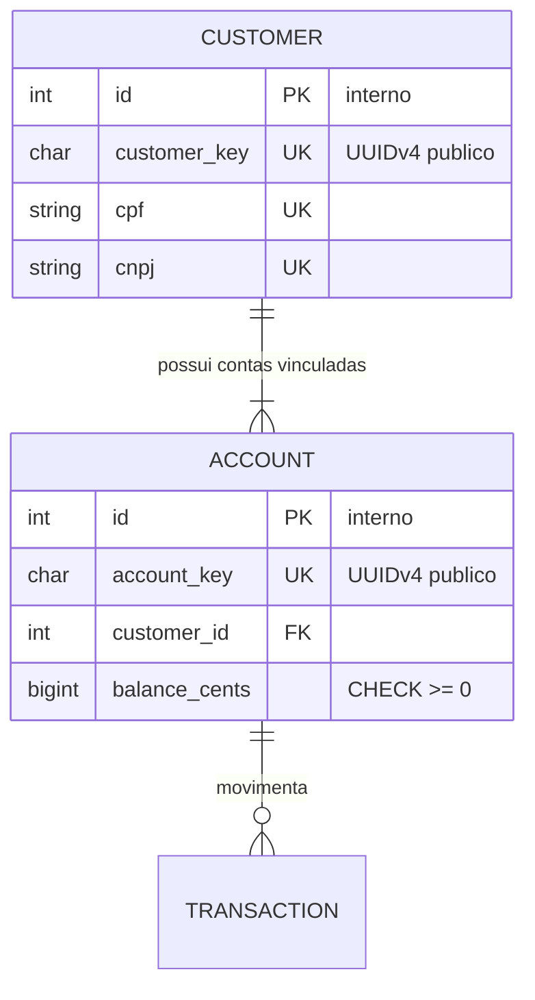
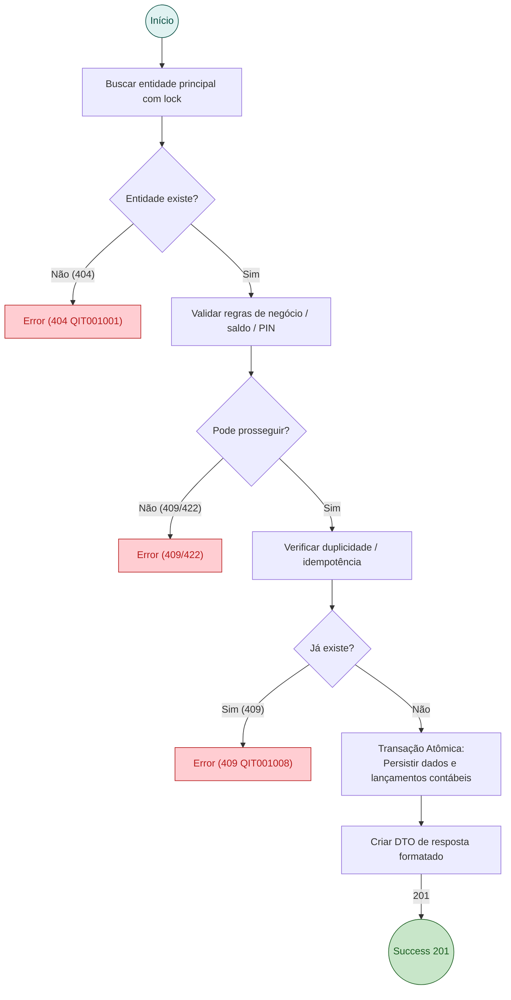

# Modelo Oficial de RFC (Template Base)

> [!NOTE]
> Este documento é o **template padrão** para criação de novas RFCs (Request for Comments) no projeto CoreBank MEI. Para criar uma nova RFC, copie este modelo para `docs/rfc/rfc-<NN>-<slug>.md` e preencha todas as seções obrigatórias.

---

# RFC — [Título da Funcionalidade / Arquitetura]

| | |
|---|---|
| **Status** | **[Proposta \| Em Refinamento \| Aprovada \| Substituída]** |
| **Time** | [Nome do Autor / Time] |
| **Data** | [DD/MM/AAAA] |
| **Versão** | [Número da Versão] |

---

## Contextualização

### Entendendo o problema
[Explique em 1 ou 2 parágrafos a dor real do cliente/usuário MEI, o contexto regulatório ou de negócio, e os riscos de uma modelagem inadequada.]

### Explicando a solução de forma macro
[Apresente a solução proposta em alto nível, destacando as principais entidades, mecanismos de consistência contábil e como a dor é resolvida.]

### Alternativas Descartadas e Trade-offs
[Liste no mínimo 3 alternativas técnicas ou de produto que foram consideradas e descartadas, explicando o porquê da rejeição e em qual cenário ela ganharia.]
- *[Alternativa A]* — descartada porque... Ganharia apenas em...
- *[Alternativa B]* — descartada porque... Ganharia apenas em...
- *[Alternativa C]* — descartada porque... Ganharia apenas em...

---

## Implementação

### Diretriz Obrigatória de Testes
> [!IMPORTANT]
> **Padrão do Projeto: Apenas Testes de Integração (Sem Testes Unitários)**
> Conforme definido no [ADR-0001](file:///home/jpcalsavara/projetos/andamento/bootcamp-qitech-api/docs/adr/0001-apenas-testes-de-integracao.md), nenhuma funcionalidade deve possuir testes unitários com mocks. Toda a suíte de testes deve ser escrita sob `tests/integration/`, exercitando os endpoints FastAPI via `ClientRequisition` / `RequestGenerator` contra o banco de dados PostgreSQL local real.

---

### Rotas Propostas

| Método | Caminho | O que faz | Entrada (campos que importam) | Saídas (status e quando) |
|---|---|---|---|---|
| `POST` | `/exemplo` | Breve descrição da ação | `campo_1`, `campo_2`, cabeçalho `Idempotency-Key` | `201` criado; `400` payload inválido (`QIT000001`); `404` não encontrado (`QIT001001`); `409` conflito |
| `GET` | `/exemplo/{key}` | Consulta de dados | `key` no caminho | `200` sucesso com DTO formatado; `404` não encontrado |

---

### Banco de Dados (Diagrama ER)

---

### Desenho de Fluxo da Rota (As Seis Perguntas Respondidas no Desenho)

> [!IMPORTANT]
> **Diagrama Base Obrigatório de Toda RFC**: Toda rota crítica deve possuir seu fluxo mapeado respondendo às 6 perguntas fundamentais:
> 1. Qual é o endpoint e método (`POST /...`)?
> 2. Quais são as validações e buscas no banco?
> 3. Quais são os desvios de erro e respectivos códigos HTTP (`404`, `409`, `422`)?
> 4. O que é criado/alterado no banco e qual o estado resultante?
> 5. Qual DTO de resposta é construído?
> 6. Qual o código de sucesso retornado (`200`, `201`, `202`)?

---

### Fluxos Detalhados Textuais

#### Fluxo 1: Caminho Feliz
1. O Resource recebe a requisição e valida o contrato via JSON Schema.
2. O Controller valida as regras de negócio e adquire locks ordenados se necessário.
3. O Repository executa a persistência atômica.
4. O DTO formata a resposta de sucesso (`200`/`201`/`202`).

#### Fluxo 2: Caminhos de Falha
1. Validação de formato incorreto: responde `400 Bad Request` com código `QIT000001`.
2. Recurso não encontrado: responde `404 Not Found` com código `QIT001001`.
3. Conflito de estado ou regra de negócio: responde `409 Conflict` ou `422 Unprocessable Entity`.

---

## Principal Desafio

- **Qual é:** [Descreva o desafio de concorrência, consistência ou segurança da funcionalidade.]
- **Por que é difícil:** [Explique as condições de corrida, riscos de deadlock ou falhas distribuídas envolvidas.]
- **Como o desenho resolve:** [Apresente a solução matemática, de banco ou de arquitetura adotada.]
