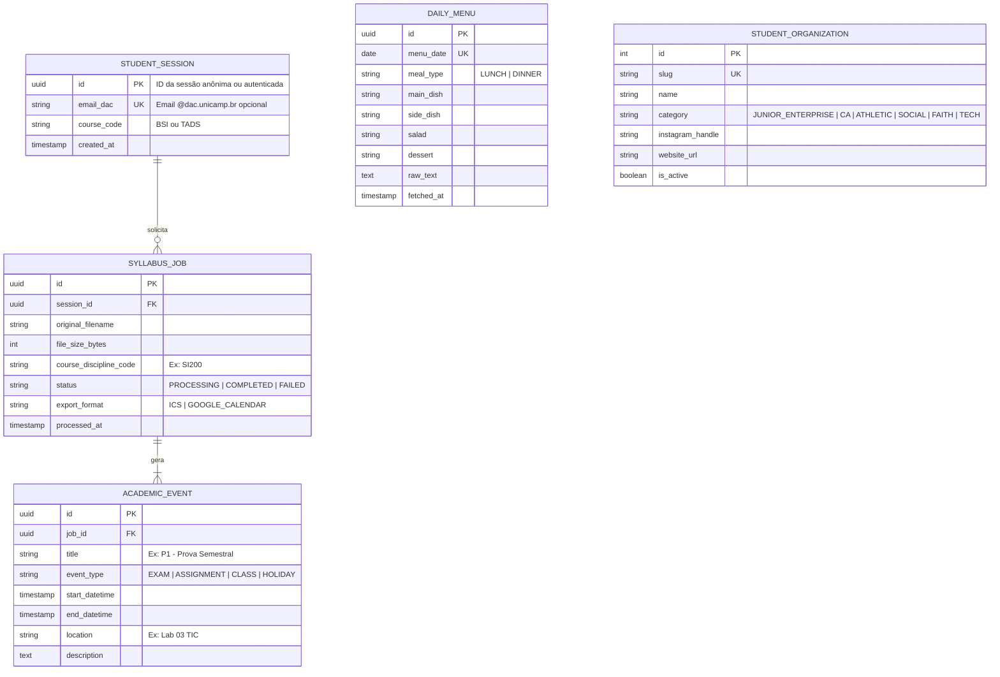
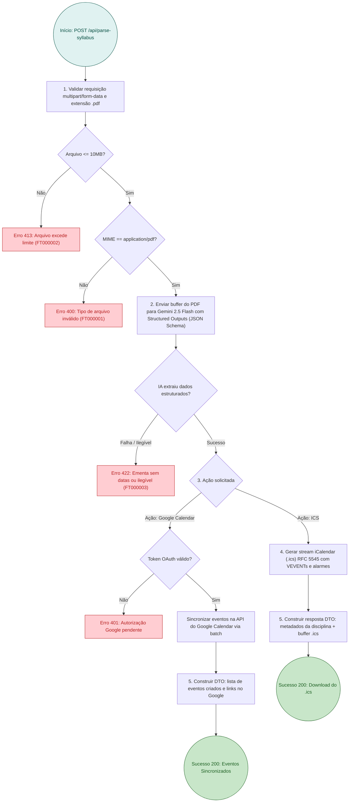

# RFC 01: Arquitetura da Aplicacao e Plataforma Kit Calouro FT Unicamp

| | |
|---|---|
| **Status** | **Proposta** |
| **Time** | Engenharia de Software / Comunidade FT Unicamp |
| **Data** | 28/09/2026 |
| **Versao** | 1.0.0 |

---

## Contextualizacao

### Entendendo o problema
O ingresso dos calouros na Faculdade de Tecnologia da Unicamp, Campus 1 em Limeira, especialmente nos cursos de computacao BSI e TADS, e marcado por uma dispersao critica de informacoes vitais. Regras burocraticas complexas da Diretoria Academica DAC, tais como Coeficiente de Rendimento CR, Coeficiente de Progressao CP, limites de integralizacao, curricularizacao da extensao e choque de turnos entre estagio e aulas diurnas, nao sao explicadas de forma pragmatica e estrategica aos ingressantes.

Essa assimetria informacional resulta em calouros tomando decisoes precoces que prejudicam sua trajetoria academica e empregabilidade:
1. Alunos de BSI ignoram a concorrencia feroz por vagas noturnas de TADS no terceiro e quarto ano, negligenciando o CR no ciclo basico e ficando impossibilitados de conciliar estagios em horario comercial.
2. Estudantes aceleram a formatura sem cumprir estagios previos, caindo na armadilha da extincao do contrato pela Lei do Estagio, Lei 11.788 de 2008, e enfrentando a barreira de contratacao para vagas de Junior sem experiencia.
3. Desconhecimento da infraestrutura fisica da FT e desorientacao quanto ao uso de ferramentas de inteligencia artificial.

### Explicando a solucao de forma macro
A solucao proposta e o Kit Calouro FT Unicamp: uma plataforma web moderna, rapida e responsiva construida em Next.js 15 App Router e hospedada na Vercel, que unifica a curadoria definitiva de conteudo estrategico da vida academica e profissional na FT com componentes e rotinas serverless.

A plataforma organiza-se em dois pilares:
1. Frontend Informativo e Interativo: Landing page e rotas tematicas em Sass e Framer Motion, dividida em secoes verticais de academico, carreira, estudos e campus.
2. Servicos e Automacoes: Prompts estruturados e gerador de calendario iCalendar padrao RFC 5545, alem de catalogo integrado de links oficiais.

### Alternativas Descartadas e Trade-offs

- *Alternativa A: Wiki Estatica tradicional ou paginas institucionais no Portal da FT ou Moodle*: descartada porque possui baixa adesao dos estudantes, interface desatualizada, ausencia de busca rapida e total impossibilidade de executar rotinas interativas como visualizacao e exportacao de calendarios. Ganharia apenas em custo de manutencao zero de infraestrutura e dependencia nula de APIs externas.
- *Alternativa B: Aplicativo Mobile Nativo em React Native ou Flutter*: descartada devido ao elevado atrito de instalacao para calouros, alem do esforco dobrado para sincronizacao e publicacao em lojas de aplicativos. Ganharia em notificacoes push nativas no dispositivo e acesso a sensores de geolocalizacao no campus.
- *Alternativa C: Processamento de PDF via OCR tradicional local em contêiner dedicado*: descartada porque planos de aula dos docentes da FT possuem diagramacoes tabulares e textuais heterogeneas e nao padronizadas, nas quais bibliotecas de extracao puramente textual falham ao correlacionar datas, topicos e criterios avaliativos. Ganharia apenas em custo por requisicao zero caso houvesse infraestrutura de servidores locais pre-existente.

---

## Implementação

### Diretriz Obrigatória de Testes

> [!IMPORTANT]
> **Padrão de Qualidade: Testes de Integração e Contrato de API (Sem Mocks de Regras Centrais)**
> Toda a camada de automação backend e integração de rotas deve ser coberta por testes de integração sob `tests/integration/`, exercitando:
> 1. Validação de upload de arquivo `multipart/form-data` para a rota `/api/parse-syllabus` validando schema de payload, tipos MIME permitidos (`application/pdf`) e limite de tamanho (máximo 10MB).
> 2. O parser do Gemini deve ser testado com fixtures reais de ementas de disciplinas da FT (SI, ST, etc.), validando a saída estrita em JSON Schema antes da geração do `.ics`.
> 3. A rota de cardápio e webhooks deve validar idempotência e formato da carga útil disparada para os canais de notificação.
> 4. Testes de renderização end-to-end de componentes críticos via Playwright/Vitest cobrindo navegação por âncoras e responsividade mobile.

---

### Rotas Propostas

| Método | Caminho | O que faz | Entrada (campos que importam) | Saídas (status e quando) |
|---|---|---|---|---|
| `POST` | `/api/parse-syllabus` | Recebe o PDF do Plano de Ensino, extrai eventos acadêmicos via Gemini e gera `.ics` ou sincroniza com Google Calendar | `file` (`multipart/form-data`, PDF), `timezone` (ex: `America/Sao_Paulo`), `action` (`ics` \| `google_calendar`), `auth_code` (opcional p/ OAuth2) | `200` OK com arquivo `.ics` ou confirmação de sync; `400` arquivo inválido/não PDF (`FT000001`); `413` arquivo excede 10MB (`FT000002`); `422` falha de extração/conteúdo ilegível (`FT000003`); `500` erro de gateway de IA |
| `POST` | `/api/menu-notifier` | Executa rotina cron/webhook para extração do cardápio do Bandejão e envio de avisos | Cabeçalho `Authorization: Bearer <CRON_SECRET>`, payload opcional com `campus` (`FT` \| `FCA`) e `date` | `200` sucesso com total de notificações disparadas; `401` não autorizado; `422` cardápio indisponível na fonte; `502` falha ao acessar portal da prefeitura |
| `GET` | `/api/organizations` | Lista entidades estudantis, ligas, atlética e comunidades com links sociais ativos | Query params: `category` (`academico` \| `carreira` \| `social` \| `fe` \| `tech`) | `200` lista formatada de organizações com links checados |
| `GET` | `/api/rooms/availability` | Consulta sintética de ocupação de espaços e links oficiais da Intranet FT | Query param: `bloco`, `data`, `periodo` (`manha` \| `tarde` \| `noite`) | `200` quadro consolidado de horários livres e link direto para `sistemas.ft.unicamp.br/salas` |

---

### Banco de Dados (Diagrama ER)

Para persistência de configurações, logs de processamento serverless, cache de cardápio e métricas de uso (armazenados em banco relacional PostgreSQL / Vercel Postgres / Supabase):

---

### Desenho de Fluxo da Rota Crítica (`POST /api/parse-syllabus`)

Mapeamento do fluxo de parsing inteligente respondendo às 6 perguntas fundamentais da arquitetura:

---

### Fluxos Detalhados Textuais

#### Fluxo 1: Caminho Feliz do Syllabus to Calendar
1. O calouro ou veterano acessa a seção `#hero` da Landing Page e faz drag-and-drop do PDF da ementa/cronograma da disciplina (fornecida pelo docente no Moodle).
2. O Client Component dispara `POST /api/parse-syllabus` via `FormData`.
3. O Route Handler valida o cabeçalho e envia o buffer diretamente ao SDK `@google/genai` (modelo Gemini Flash), acionando `response_schema` com tipagem de datas, horários, tipo de evento (P1, P2, Entrega de Lab, Exame) e descrição.
4. O Route Handler processa o array tipado gerado pela IA e compila o payload conforme o padrão iCalendar (RFC 5545), incluindo alertas programados para 24h e 2h antes de cada avaliação.
5. Retorna `200 OK` com cabeçalho `Content-Type: text/calendar` e `Content-Disposition: attachment; filename="disciplina-FT-2026.ics"`, disparando download imediato no navegador.

#### Fluxo 2: Caminhos de Falha
1. **Arquivo não suportado ou corrompido**: Se o usuário enviar um arquivo não PDF ou corrompido, a validação inicial responde `400 Bad Request` com código `FT000001`.
2. **Arquivo excessivamente grande**: Caso exceda 10MB, responde `413 Payload Too Large` com código `FT000002`.
3. **Documento sem cronograma identificado**: Se o PDF consistir apenas em bibliografia ou texto corrido sem datas semestrais identificáveis, a validação de extração retorna `422 Unprocessable Entity` (`FT000003`), instruindo o usuário na UI a verificar o arquivo correto no Moodle.
4. **Indisponibilidade de API**: Caso o endpoint de IA ou Vercel Edge sofra timeout (>25s), um fallback com `504 Gateway Timeout` é tratado na UI sugerindo tentar novamente ou usar um PDF menor.

---

### Mapeamento das Seções de Conteúdo e Interface da Landing Page

A aplicação unifica as 20 seções estruturadas no arquivo de especificação sob componentes modulares do Next.js:

1. **`HeroSection` (`#hero`)**:
   - Apresentação da FT e boas-vindas ao calouro.
   - Dropzone interativo para upload de plano de ensino em PDF (`Syllabus to Calendar`).
2. **`ToolsSection` (`#ferramentas-ti`)**:
   - Passo a passo de autenticação nas máquinas dos laboratórios da FT (TIC).
   - Configuração de rede sem fio Eduroam, Moodle Unicamp e acesso ao sistema e-DAC.
3. **`RoomsSection` (`#reserva-salas`)**:
   - Guia de consulta em tempo real (`sistemas.ft.unicamp.br/salas`).
   - Regras de uso espontâneo para estudos e processo de reserva formal via entidades ou docentes.
   - **Táticas de Justificativa Técnica para Salas Maiores**: bancadas com tomadas múltiplas, captação acústica/híbrida para gravação, layout modular de hackathon e fluxo flutuante de atendimento.
4. **`CourseComparisonSection` (`#bsi-vs-tads`)**:
   - Tabela comparativa interativa: Bacharelado (4 anos, diurno) vs Tecnólogo (3 anos, noturno).
   - O fenômeno da "Batalha por Vagas Noturnas": por que alunos de BSI disputam turmas de TADS a partir do 5º semestre ao ingressarem em estágios comerciais e a importância do CR elevado.
   - Cenários de curto prazo vs. longo prazo (pós-graduação estrita/vistos no exterior vs. faturamento rápido no mercado).
5. **`AcademicRulesSection` (`#grade-e-regras`)**:
   - Cálculo e impacto do CR e CP.
   - Entendendo os vetores DAC (`T-P-L-O`) e 1 crédito = 15 horas semestrais.
   - Diferenciação entre Eletivas do Catálogo vs Eletivas Livres (FCA, Barão Geraldo, CEL).
   - Acompanhamento do progresso acadêmico pelo portal Grade DAC Online (`grade.daconline.unicamp.br`).
6. **`GraduationChecklistSection` (`#checklist-formatura`)**:
   - Os 5 pilares de integralização: disciplinas obrigatórias, cota de eletivas, 60h de complementares/extensão, TCC/estágio e nada consta na biblioteca.
   - Painel interativo de checagem conectado aos critérios da Grade DAC Online.
7. **`CourseStrategySection` (`#estrategia-curso`)**:
   - A tática de desacelerar o curso: por que colar grau sem estágio é arriscado sob a Lei nº 11.788/2008.
   - Desmistificação de reprovações em matérias de exatas e manejo seguro de prazos máximos na DAC (até 14 semestres em BSI e 10 em TADS).
8. **`AiStudySection` (`#ia-para-estudos`)**:
   - Guia do NotebookLM como segundo cérebro ancorado nas ementas e provas passadas da FT.
   - Método "Construa na mão primeiro, refatore com IA depois".
   - Prática de Feynman e Rubber Duck socrático.
9. **`AiDevSection` (`#ia-para-devs`)**:
   - Transição de chatbots passivos para agentes autônomos de código (loop ReAct, MCP - Model Context Protocol).
   - Ambientes: IDE (Cursor, Windsurf, Cline) e CLI de terminal (Claude Code, Aider).
10. **`ExtracurricularSection` (`#extensao-e-horas`)**:
    - Validação de certificados de 60 horas.
    - Coursera for Campus com e-mail `@dac.unicamp.br`.
    - Eventos anuais (Tecnologia em Foco, SEMELIM) e projetos de extensão (Semeia Code, Enactus, ASAS, C6 Code).
11. **`TechRoadmapsSection` (`#trilhas-tech`)**:
    - Roadmap visual integrado com [roadmap.sh](https://roadmap.sh).
    - Trilha Dev: TypeScript First (Node, React, Next.js, Fastify).
    - Trilha Dados/IA: Python First (Pandas, Scikit-learn, PyTorch, FastAPI).
12. **`CloudSection` (`#cloud-estudante`)**:
    - Vouchers de certificações sem custo via programas universitários (AWS Educate, Cloud Clubs, Google Cloud Innovators).
    - O valor real de projetos conteinerizados no GitHub vs certificações puramente teóricas.
13. **`InternshipSection` (`#estagios`)**:
    - Calendário de feiras (Liestag, Unicamp) entre agosto e outubro.
    - Preparação técnica para processos (HashMaps, POO, lógica limpa).
14. **`PortfolioSection` (`#portfolio-dev`)**:
    - Template de currículo em página única em LaTeX para Overleaf (otimizado para sistemas ATS).
    - Diretrizes de perfil no GitHub e LinkedIn.
15. **`ScientificInitiationSection` (`#iniciacao-cientifica`)**:
    - Diferenças entre PIBIC/CNPq (edital anual, bolsa semestral) e FAPESP (fluxo contínuo, dedicação exclusiva).
    - Mapeamento de linhas de pesquisa e docentes de computação na FT.
16. **`CampusLifeSection` (`#campus-vida`)**:
    - Horários do bandejão, cardápio online e circular gratuito FT-FCA.
    - Fretado intercampi Limeira-Campinas (Linha 84).
17. **`SocialAndSportsSection` (`#social-e-esportes`)**:
    - Atlética AAATU, treinos, Intercalouros e integração.
    - Bares locais (terças e quintas) e segurança no deslocamento noturno.
18. **`FaithCommunitiesSection` (`#comunidade-fe`)**:
    - Mosaico Unicamp Limeira e rede de repúblicas cristãs.
19. **`StudentEconomySection` (`#grupos-e-escambo`)**:
    - Grupos de desapego e escambo de móveis de veteranos.
    - Cartilha de segurança anti-golpes e caronas solidárias Limeira-Campinas-SP.
20. **`MediaChannelsSection` (`#canais-tech`)**:
    - Recomendações de canais de engenharia de software e system design (Akita, Galego, ByteByteGo, ThePrimeagen, etc.).
21. **`OrganizationsDirectorySection` (`#organizacoes`)**:
    - Cards com links diretos das organizações estudantis mapeadas (Atria Jr., CDI, AAATU, Liestag, LiUP Liga de Startups, Semeia Code, etc.).

---

## Principal Desafio

- **Qual é:** A extração precisa e confiável de datas e eventos a partir de PDFs de planos de aula heterogêneos fornecidos pelos professores da FT, sem alucinações e com tolerância à variedade de formatações de ementas semestrais.
- **Por que é difícil:** Cada professor utiliza um layout distinto no Moodle: alguns inserem tabelas com colunas de datas, outros escrevem texto corrido ("Semana 03: Prova teórica"), outros mesclam datas relativas ("15 dias após o início das aulas"). Parsers determinísticos baseados em regex ou bibliotecas estáticas quebram sistematicamente. Além disso, rotas serverless na Vercel possuem limites estritos de tempo de execução e memória.
- **Como o desenho resolve:** O desenho utiliza o modelo Gemini 2.5 Flash com schema JSON forçado via Structured Outputs do SDK `@google/genai`. O prompt do sistema injeta o ano e semestre letivo vigente como âncora temporal fixa e normaliza datas relativas para o fuso `America/Sao_Paulo`. A resposta JSON tipada é validada em runtime por um schema Zod antes de ser compilada no formato padronizado RFC 5545 (`.ics`), garantindo compatibilidade universal com Apple Calendar, Google Calendar e Outlook sem risco de corrupção de arquivo.
